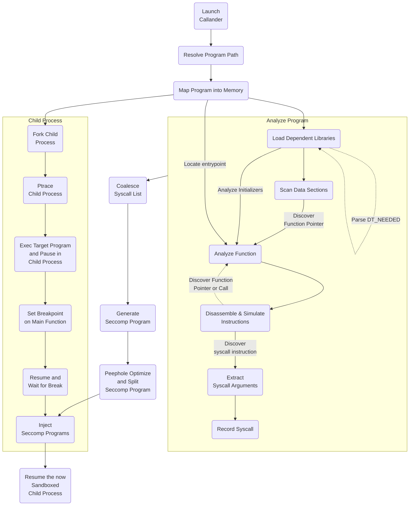

# 

Callander is a simple system sandboxing tool for Linux. It uses program analysis
to generate and apply right-sized seccomp sandboxes to programs. It can help you
isolate the effects of software that might have security issues, such as memory
corruption vulnerabilities. For many programs, using it is as simple as
prefixing your command with `callander`.

Callander is different from other system call sandboxing tools in that it
doesn't require any policy to be specified. Instead it analyzes any program it
is asked to run to discover the exact calls, arguments, and call sites
that the program could make. Callander uses this information to construct a
precise policy limiting the program to only the operations the program could
normally perform. These policies can be both more precise and more accurate than
profiles assembled by hand or by observing program behavior. Even the most
obscure error paths are analyzed and accounted for, unlike with
observation-derived system call lists. Additionally, Callander waits for the
process to initialize before applying a sandboxing policy, and thus can use
a more restrictive policy that blocks calls that only occur during startup. This
means many programs can run without the ability to forge executable memory
mappings.

Information on how callander works was presented at All Day DevOps 2023.
[Slides](https://docs.google.com/presentation/d/1YHSBabFotD6UylVz8r4-DaJa5ZxxNUwmu-jf8bvyNgA/edit#slide=id.p)
and [a recording](https://play.vidyard.com/QnNz346tpULkHSwNSDy4oJ) of this talk
are available.


## Installation

1. Download a .tgz from https://github.com/rpetrich/callander/releases/latest
2. Extract with `tar xfz callander-*.tgz` or a graphical decompression utility
3. Run a command prefixed with the path to `callander`

## Usage

Prefix any command you wish to run sandboxed with `callander`. Callander will
analyze, apply the sandbox, and run the program.

Add the `--show-permitted` option to see which system calls callander has
discovered your command uses:

```
$ callander --show-permitted echo hi
callander: permitted syscalls: read(any u32, any, any) @ libc.so.6+0x11ba5f(__read+15)
read(any u32, any, any) @ libc.so.6+0x11ba98(__read+72)
read(any u32, any, any) @ libc.so.6+0x11c9e6(__read_nocancel+6)
write(any u32, any, any) @ libc.so.6+0x11c572(write+18)
write(any u32, any, any) @ libc.so.6+0x11c5ab(write+75)
write(any u32, any, any) @ libc.so.6+0x11cab9(__write_nocancel+9)
close(any u32) @ libc.so.6+0x1166f2(close+18)
close(any u32) @ libc.so.6+0x11671a(close+58)
close(any u32) @ libc.so.6+0x11c609(__close_nocancel+9)
fstat(any u32, any) @ libc.so.6+0x117389(fstat+9)
lseek(any u32, any, any) @ libc.so.6+0x11afd9(lseek+9)
mmap(0, any, PROT_READ|PROT_WRITE, any u32, -1 as u32, 0) @ libc.so.6+0x12531a(mmap+42)
mmap(any, any, PROT_NONE-PROT_READ, any u32, any u32, 0) @ libc.so.6+0x12531a(mmap+42)
mmap(0, any, PROT_NONE-PROT_READ, any u32, any u32, 0) @ libc.so.6+0x12537d(mmap+141)
mmap(0, any, PROT_READ|PROT_WRITE, any u32, -1 as u32, 0) @ libc.so.6+0x12537d(mmap+141)
mprotect(any, any, PROT_READ|PROT_WRITE) @ libc.so.6+0x125c19(mprotect+9)
munmap(any, any) @ libc.so.6+0x125d49(munmap+9)
brk(any) @ libc.so.6+0x11d779(brk+9)
rt_sigaction(SIGABRT, any, 0, 8) @ libc.so.6+0x45408(__libc_sigaction+216)
rt_sigprocmask(SIG_UNBLOCK, any, 0, 8) @ libc.so.6+0x288b5(abort+149)
rt_sigprocmask(SIG_BLOCK, libc.so.6+0x1d5e30(sigall_set*), any, 8) @ libc.so.6+0x9ea62(pthread_kill+98)
rt_sigprocmask(SIG_SETMASK, any, 0, 8) @ libc.so.6+0x9eaae(pthread_kill+174)
rt_sigprocmask(SIG_SETMASK, any, 0, 8) @ libc.so.6+0xa3f36(pthread_sigmask+70)
rt_sigreturn(any) @ libc.so.6+0x45327
ioctl(any u32, TCGETS, any) @ libc.so.6+0x11ce4c(tcgetattr+44)
pread64(STDIN_FILENO-0xfffffffe, any, 511, 0) @ libc.so.6+0x11c9ac(__pread64_nocancel+12)
writev(any u32, any, any) @ ld-linux-x86-64.so.2+0xe52a(_dl_debug_vdprintf*+314)
writev(STDERR_FILENO, any, any) @ libc.so.6+0x9095f(__libc_message_impl*+351)
mremap(any, any, any, MREMAP_MAYMOVE, any) @ libc.so.6+0x12a34f(mremap+47)
madvise(any, any, MADV_DONTNEED) @ libc.so.6+0x1250b9(madvise+9)
madvise(any, any, MADV_HUGEPAGE) @ libc.so.6+0x1250b9(madvise+9)
getpid() @ ld-linux-x86-64.so.2+0x25fc9(__GI___getpid*+9)
getpid() @ libc.so.6+0xf5a99(getpid+9)
exit(0) @ libc.so.6+0x2a1ec(__libc_start_call_main*+156)
fcntl(any u32, F_SETFD, 1) @ libc.so.6+0x11c710(__fcntl64_nocancel*+64)
fcntl(any u32, F_GETFL, any) @ libc.so.6+0x11c710(__fcntl64_nocancel*+64)
getcwd(non-NULL, any) @ libc.so.6+0x11a499(getcwd+137)
sched_getparam(any u32, any) @ libc.so.6+0x10e659(sched_getparam+9)
sched_setscheduler(any u32, any u32, any) @ libc.so.6+0x10e7a9(sched_setscheduler+9)
sched_getscheduler(any u32) @ libc.so.6+0x10e689(__sched_getscheduler+9)
sched_get_priority_max(1) @ libc.so.6+0x10e6b9(__sched_get_priority_max+9)
sched_get_priority_min(1) @ libc.so.6+0x10e6e9(sched_get_priority_min+9)
prctl(PR_SET_VMA, 0, NULL-0xfffffffffffffffe, NULL-0xfffffffffffffffe, libc.so.6+0x1cc2f9) @ libc.so.6+0x12a7bd(__set_vma_name*+125)
prctl(PR_SET_VMA, 0, NULL-0xfffffffffffffffe, any, libc.so.6+0x1cc637) @ libc.so.6+0x12a7bd(__set_vma_name*+125)
prctl(PR_SET_VMA, 0, any, any, libc.so.6+0x1cc622) @ libc.so.6+0x12a7bd(__set_vma_name*+125)
gettid() @ libc.so.6+0x9eb05(pthread_kill+261)
futex(any, any u8, 1, 0, any u32, any)
futex(any, any u8, 1, 0, any, any u32)
futex(any, any u8, INT_MAX, 0, any u32, any)
futex(any, any u8, INT_MAX, 0, any, any u32)
futex(any, any u32, any u32, 0, 0, -1 as u32)
futex(any, FUTEX_WAIT|FUTEX_PRIVATE_FLAG, any u32, 0, 202, any)
futex(any, FUTEX_WAIT|FUTEX_PRIVATE_FLAG, 2, 0, any, any)
futex(any, FUTEX_WAKE|FUTEX_PRIVATE_FLAG, 1, 0, any, any)
futex(any, FUTEX_WAKE|FUTEX_PRIVATE_FLAG, INT_MAX, 0, any, any)
futex(ld-linux-x86-64.so.2+0x38a08(_rtld_global+2568), FUTEX_WAIT, NULL-0xfff80002, 0, NULL-0xfff80000, NULL-0xfff80001)
futex(ld-linux-x86-64.so.2+0x38a08(_rtld_global+2568), FUTEX_WAIT, 0x1-0xffffffff, 0, ld-linux-x86-64.so.2+0x38a28(_rtld_global+2600), any u32)
futex(ld-linux-x86-64.so.2+0x38a08(_rtld_global+2568), FUTEX_WAIT, 2, 0, 128, any)
futex(ld-linux-x86-64.so.2+0x38a08(_rtld_global+2568), FUTEX_WAKE, 1, 0, any, any)
futex(ld-linux-x86-64.so.2+0x38a08(_rtld_global+2568), FUTEX_LOCK_PI-FUTEX_UNLOCK_PI, 0, 0, any, any u32)
futex(ld-linux-x86-64.so.2+0x38a08(_rtld_global+2568), FUTEX_UNLOCK_PI, 0, 0, ld-linux-x86-64.so.2+0x38a08(_rtld_global+2568), any)
futex(ld-linux-x86-64.so.2+0x38a08(_rtld_global+2568), FUTEX_WAIT|FUTEX_PRIVATE_FLAG, NULL-0xfff80002, 0, NULL-0xfff80000, NULL-0xfff80001)
futex(ld-linux-x86-64.so.2+0x38a08(_rtld_global+2568), FUTEX_LOCK_PI|FUTEX_PRIVATE_FLAG, 0, 0, any, any u32)
futex(ld-linux-x86-64.so.2+0x38a08(_rtld_global+2568), FUTEX_UNLOCK_PI|FUTEX_PRIVATE_FLAG, 0, 0, ld-linux-x86-64.so.2+0x38a08(_rtld_global+2568), any)
futex(libc.so.6+0x20472c(once*), FUTEX_WAIT|FUTEX_PRIVATE_FLAG, any u32, 0, NULL-0x1, any)
futex(libc.so.6+0x2119a0(once.0*), FUTEX_WAIT|FUTEX_PRIVATE_FLAG, any u32, 0, any, any)
sched_getaffinity(0, 0x1000, any) @ libc.so.6+0x11fab6(__get_nprocs_sched*+54)
getdents64(any u32, any, any) @ libc.so.6+0xed935(getdents64+21)
restart_syscall()
clock_gettime(CLOCK_REALTIME-CLOCK_MONOTONIC, any) @ libc.so.6+0xec97d(__clock_gettime+45)
clock_nanosleep(CLOCK_REALTIME, 0, any, any) @ libc.so.6+0xeca78(clock_nanosleep+88)
clock_nanosleep(any u32, 0, any, any) @ libc.so.6+0xecadd(clock_nanosleep+189)
clock_nanosleep(CLOCK_MONOTONIC, 0, any, any) @ libc.so.6+0xecb29(clock_nanosleep+265)
clock_nanosleep(CLOCK_MONOTONIC, 0, any, any) @ libc.so.6+0xecb4b(clock_nanosleep+299)
clock_nanosleep(CLOCK_MONOTONIC, 0, any, any) @ libc.so.6+0xecbbc(clock_nanosleep+412)
clock_nanosleep(CLOCK_MONOTONIC, 0, any, any) @ libc.so.6+0xecc08(clock_nanosleep+488)
exit_group(NULL-0x1fe) @ ld-linux-x86-64.so.2+0x25fa3(_exit*+19)
exit_group(any u32) @ libc.so.6+0xee21b(_Exit+27)
tgkill(any u32, any u32, SIGABRT) @ libc.so.6+0x9eaef(pthread_kill+239)
tgkill(any u32, any u32, SIGFPE) @ libc.so.6+0x9eaef(pthread_kill+239)
tgkill(any u32, any u32, SIGABRT) @ libc.so.6+0x9eb1a(pthread_kill+282)
tgkill(any u32, any u32, SIGFPE) @ libc.so.6+0x9eb1a(pthread_kill+282)
openat(AT_FDCWD, any, O_RDONLY|O_CLOEXEC, any) @ libc.so.6+0x11b173(__open+83)
openat(AT_FDCWD, any, O_RDONLY|O_CLOEXEC, any) @ libc.so.6+0x11b1e3(__open+195)
openat(any u32, libc.so.6+0x1cce16, O_RDONLY, any) @ libc.so.6+0x11b2e0(openat+64)
openat(any u32, any, any u32, any) @ libc.so.6+0x11b355(openat+181)
openat(AT_FDCWD, any, O_RDONLY|O_CLOEXEC, any) @ libc.so.6+0x11c8b2(__open_nocancel+66)
openat(AT_FDCWD, non-NULL, O_RDONLY, any) @ libc.so.6+0x11c8b2(__open_nocancel+66)
openat(AT_FDCWD, non-NULL, O_RDONLY|O_NONBLOCK|O_DIRECTORY|O_CLOEXEC, any) @ libc.so.6+0x11c8b2(__open_nocancel+66)
openat(AT_FDCWD, libc.so.6+0x1ce4b7, O_RDONLY|O_DIRECTORY, any) @ libc.so.6+0x11c8b2(__open_nocancel+66)
newfstatat(any u32, any, any, AT_SYMLINK_NOFOLLOW) @ libc.so.6+0x1173bc(fstatat64+12)
prlimit64(0, RLIMIT_NOFILE, 0, any) @ libc.so.6+0x11d1c2(__getrlimit+18)
getrandom(libc.so.6+0x20a178(tcache_key*), 8, GRND_NONBLOCK) @ libc.so.6+0xa9d97(ptmalloc_init.part.0*+55)
hi
```

## Limitations

Programs that launch other programs are not supported by callander, due to the
limitations of seccomp. If asked to run a program that does `exec` other
programs, callander will emit an error that can be overridden with the
`--block-exec` option.

x86_64 and aarch64 linux binaries are available. No support for other
architectures is planned.

Additionally, callander is beta software and requires more real-world testing.
If you have a program that it doesn't analyze properly or rejects, please open
an issue.

## Architecture

Callander's high-level architecture is a hybrid of patterns found in binary
analysis tools, debuggers, and simple compilers.



## Building

Callander can be built by running make:

```bash
git clone git@github.com:rpetrich/callander.git
cd callander/src
make -j4
```

For best results, use a modern version of gcc to produce completely static
binaries that run on any recent Linux kernel.

## Special Thanks

The logo was generously provided by my frequent collaborator, [Kelly Shortridge](https://kellyshortridge.com/). Without this and other contributions, Callander would not exist.

aarch64 disassembly uses Vector35's [arm64 disassembler](https://github.com/Vector35/binaryninja-api/tree/dev/arch/arm64).

x86 disassembly uses length disassembler by Stefan Johnson.
